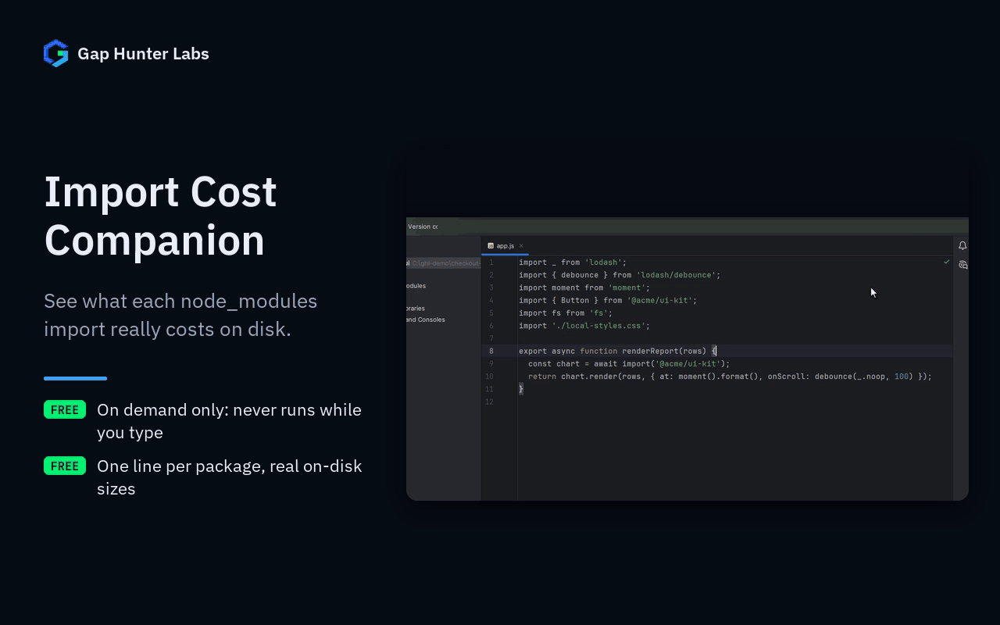

# Import Cost Companion

IntelliJ-family plugin. Run **Check Import Sizes** on a JS/TS file and
get a real report of every `node_modules` package it imports, sorted
by on-disk size, with unusually large ones flagged.



Each feature on its own:
[The report](docs/media/01-report.gif)

## Why it exists

Born from real evidence in JetBrains Marketplace reviews of the
closest existing plugin in this space (135K downloads, 75% of reviews
at 3 stars or fewer): a documented, years-long pattern of severe CPU
spikes and IDE freezes —

- *"drains 100% CPU... My notebook becomes hot... battery lasts for
  one hour"*
- *"freezes my IDE and I cannot work!"*
- *"caused significant performance issues in WebStorm, making the IDE
  almost unusable"*

— from recalculating package sizes continuously, inline, on every
keystroke.

## Why built this way

- **On-demand only, never automatic.** The direct fix for a
  performance complaint rooted in "this runs constantly in the
  background" is a design that structurally can't reproduce it — not
  a faster version of the same always-on computation. This plugin
  never recomputes anything without you asking it to.
- **Real on-disk file sizes, never a bundler invocation.** Reading file
  sizes from `node_modules` is cheap; running a bundler synchronously
  and repeatedly is what actually causes the kind of CPU spikes cited
  above.
- **Import detection by regex on the file's own text, not a full
  JS/TS AST parse.** Works without depending on a JavaScript language
  plugin being installed, at the honest cost of missing genuinely
  exotic import syntax — an acceptable, deliberate trade-off for a
  report-on-demand tool.
- **A package that isn't found locally gets an honest "not found
  locally" note, never a fake `0 B`.**
- **100% local** — no network call, no account, no telemetry.

## Usage

Right-click a JS/TS file → **Check Import Sizes**. Opens
`import-cost-report.md` next to the file: one line per package
(`lodash` and `lodash/debounce` are the same package, listed once with
both imports), static imports, `require()` and dynamic `import()`, and
Node.js built-ins (`fs`, `node:path`) listed apart instead of as "not
found" — unless a package of that name is installed, as browser
polyfills like `buffer` or `events` are. (Before 0.1.1 each import was
its own line, built-ins showed as "not found locally", and dynamic
imports were missed.)

## Enterprise / Team Licensing

Need enterprise features, custom rules, or team licensing? Contact us
at **gaphunterlabs@gmail.com**.

## Development

```
./gradlew test           # unit tests
./gradlew buildPlugin    # generates build/distributions/*.zip
./gradlew verifyPlugin   # checks compatibility against real IDEs
```

## License

Apache-2.0. See `LICENSE`.
